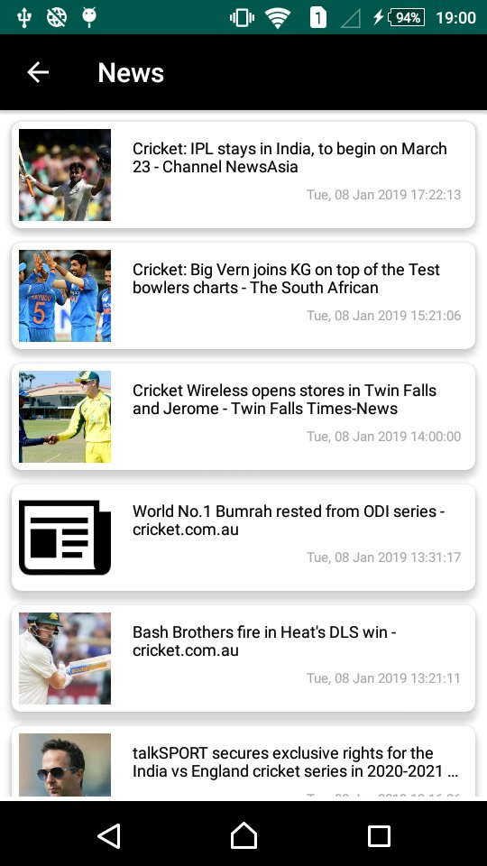

## AndroidNewsLibrary

AndroidNewsLibrary is a library that helps developers add a **"News Display"** in the Fragment or Activity to their apps.


If the user need display News Feeds than use News_Fragment OR News_Activity. 

If the user need to display News Details than use News_Details_Activity Class


## Preview News Feeds



## Installation

How to

To get a Git project into your build:

Step 1. Add the JitPack repository to your build file 


Add it in your root build.gradle at the end of repositories:

	allprojects {
		repositories {
			...
			maven { url 'https://jitpack.io' }
		}
	}


Step 2. Add the dependency

	dependencies {
	        implementation 'com.github.AppAspectTech:AndroidNewsLib:2.1'
	}

## Notes
The library is very simple, just note that :
* set Proper News keyword for display news.
* set Header Background Color as per your theme.


## How to use

1. To use this library just add this snippet in the `application` in androidManifest.xml.
```java

     // add News Feed list as well as News Details Screen
    
     <activity android:name="com.appaspect.news.androidnewslibrary.News_Activity">
     </activity>
        <activity android:name="com.appaspect.news.androidnewslibrary.News_Details_Activity">
         </activity>
        
        
2. To use this library just add this snippet in the `onCreate` of your activity.

News Screen Example:

```java
                    
                    // Add as a Activity
                    try {
                    
                                Bundle bundle_news=new Bundle();
                                bundle_news.putString(ANL_Constant_Data.News_keyword,"Cricket");    // set News keyword for listing
                                bundle_news.putString(ANL_Constant_Data.News_Header_BG_Color,"#000000"); // set Header Background Color
                                            bundle_news.putBoolean(ANL_Constant_Data.Header_Show,true);    // set Header show boolean
                                            bundle_news.putString(ANL_Constant_Data.News_Header_Text_Color,"#FFFFFF");    // set Header Text Color
                    
                                Intent intent_news=new Intent(this,News_Activity.class);
                                intent_news.putExtras(bundle_news);
                                 startActivity(intent_news);
                    
                    
                            } catch (Exception e)
                            {
                    
                            }
                            
                            
                    // add as a inner fragment 
                    try {
                    
                                String str_tag = "News_Fragment";
                            String str_addToBackStack = "News_Fragment";;
                                Bundle bundle_news=new Bundle();
                                bundle_news.putString(ANL_Constant_Data.News_keyword,"Cricket");   // set News keyword for listing
                                bundle_news.putString(ANL_Constant_Data.News_Header_BG_Color,"#000000"); // set Header Background Color
                                            bundle_news.putBoolean(ANL_Constant_Data.Header_Show,true);    // set Header show boolean
                                            bundle_news.putString(ANL_Constant_Data.News_Header_Text_Color,"#FFFFFF");    // set Header Text Color
                    
                                News_Fragment news_fragment=new News_Fragment();
                                news_fragment.setArguments(bundle_news);
                                FragmentManager fragmentManager = getSupportFragmentManager();
                                FragmentTransaction fragmentTransaction = fragmentManager.beginTransaction();
                                fragmentTransaction.replace(R.id.container, news_fragment, str_tag).addToBackStack(str_addToBackStack).commit();
                    
                    
                    
                            } catch (Exception e)
                            {
                    
                            }
                            
                            OR
                            
                            
                          // add as a main fragment  
                            try {
                            
                                        String str_tag = "News_Fragment";
                                        Bundle bundle_news=new Bundle();
                                        bundle_news.putString(ANL_Constant_Data.News_keyword,"Cricket");   // set News keyword for listing
                                        bundle_news.putString(ANL_Constant_Data.News_Header_BG_Color,"#000000"); // set Header Background Color
                                                    bundle_news.putBoolean(ANL_Constant_Data.Header_Show,true);    // set Header show boolean
                                                    bundle_news.putString(ANL_Constant_Data.News_Header_Text_Color,"#FFFFFF");    // set Header Text Color
                            
                                        News_Fragment news_fragment=new News_Fragment();
                                        news_fragment.setArguments(bundle_news);
                                        FragmentManager fragmentManager = getSupportFragmentManager();
                                        FragmentTransaction fragmentTransaction = fragmentManager.beginTransaction();
                                        fragmentTransaction.replace(R.id.container, news_fragment, str_tag).commit();
                            
                            
                            
                                    } catch (Exception e)
                                    {
                            
                                    }
                            
                            
```


## News Details Screen Example:


     
## Notes
if you have link than direct pass in the Detail Screen other wise no need to add this code.

3. To use this library just add this snippet in the `onCreate` of your activity.

News Details Screen Example:
     
  ```java 
  
   // add as a News_Details_Activity
   try {

                                            String str_title=rssFeedModelArrayList.get(position).title;
                                            String str_link=rssFeedModelArrayList.get(position).link;
                                            Bundle bundle_data=new Bundle();
                                            bundle_data.putString("news_url",str_link);
                                            bundle_data.putString("news_title",str_title);
                                            Intent marketIntent = new Intent(context,News_Details_Activity.class);
                                            marketIntent.putExtras(bundle_data);
                                            startActivity(marketIntent);

                                        } catch (Exception e) {
                                            // TODO: handle exception

                                        }
                                    }
                                    
## Used by

If you use my library, please tell me at info@appaspect.com
So I can add your app here!


## License
Do what you want with this library.
